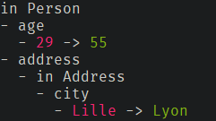
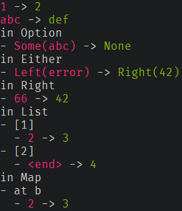
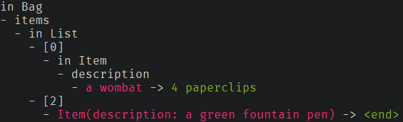
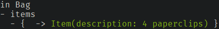

[](https://travis-ci.org/chwthewke/auto-diff)
[](http://codecov.io/github/chwthewke/auto-diff?branch=master)
[](https://maven-badges.herokuapp.com/maven-central/fr.thomasdufour/auto-diff-core_2.12)

# Structural diff for Scala types

This project provides the `Difference` ADT, which models a structural diff of
scala values. It is built (and depends) on
[cats](https://github.com/typelevel/cats) and
[shapeless](https://github.com/milessabin/shapeless).

`Difference`s are computed via the `Diff[A]` type class that provides a function
of type `(A, A) => Option[Difference]`.
 
The goal of this library is to provide convenient, customizable and extensible generic
derivation of `Diff` instances, as well as a decent textual representation
of `Difference` values.

This is intended primarily as an aid for automated testing, and was motivated 
by spending *way* too much time playing "Spot the difference" with large ADTs
in test failure logs, but there may be other use cases.

```scala
case class Address( street: String, city: String )
case class Person( name: String, age: Int, address: Address )

import fr.thomasdufour.autodiff.Diff
import fr.thomasdufour.autodiff.Pretty
import fr.thomasdufour.autodiff.derived

implicit val personDiff: Diff[Person] = {
  import derived.auto._
  derived.semi.diff
}

val difference = personDiff(
  Person( "Jean Martin", 29, Address( "2 rue Pasteur", "Lille" ) ),
  Person( "Jean Martin", 55, Address( "2 rue Pasteur", "Lyon" ) )
)

println( Pretty.colorized2.show( difference ) )
```

yields:



## How to use auto-diff

Only Scala 2.12 and 2.13 are supported, and 2.13 support starts in version 0.4.0.

| **`auto-diff`** | **Scala**  | **Cats** |
| --------------- | ---------- | -------- |
| 0.3.0           | 2.12       | 1.6.1    |
| 0.4.0           | 2.12, 2.13 | 2.0.0    |


Add some or all of the following to your `build.sbt`:

```scala
libraryDependencies ++= Seq(
  "fr.thomasdufour" %% "auto-diff-core" % "x.y.z",
  "fr.thomasdufour" %% "auto-diff-generic" % "x.y.z",
  "fr.thomasdufour" %% "auto-diff-enumeratum" % "x.y.z",
  "fr.thomasdufour" %% "auto-diff-scalatest" % "x.y.z" % "test"
)
```

For the current version, check the maven central badge at the top of this readme.

## Obtaining `Diff` instances

`Diff` instances are available implicitly (from the companion object) for:
- primitive types
- `String` and `UUID`
- `java.time` types
- Scala tuples
- Some collections and ADTs, including:
  - `Option`
  - `Either`
  - `List`, `Vector`, *finite* `Stream` and `LazyList`, `[Sorted]Set`, `[Sorted]Map` and a few more specialized variants
  - `Iterable` as a fallback
- `cats.data` types including `Validated`, `Chain` and `NonEmpty{Chain|List|Vector|Set}`
- enumeratum `Enum`s when using the `autodiff-enumeratum` module.

```scala
import fr.thomasdufour.autodiff.Diff
import fr.thomasdufour.autodiff.Pretty

def printDiff[A: Diff]( x: A, y: A ): Unit =
  println( Pretty.colorized2.showDiff( x, y ) )

printDiff( 1, 2 )
printDiff( "abc", "def" )

printDiff( Some( "abc" ), None )
printDiff( Left( "error" ), Right( 42 ) )
printDiff[Either[String, Int]]( Right( 66 ), Right( 42 ) )

printDiff( 1 :: 2 :: Nil, 1 :: 3 :: 4 :: Nil )
printDiff( Map( "a" -> 1, "b" -> 2 ), Map( "b" -> 3, "a" -> 1 ) )
```



### Generic derivation

Generic derivation is based on `shapeless.LabelledGeneric`, and is available for:
- case classes and objects
- sealed trait hierarchies

Like in Typelevel [kittens](https://github.com/typelevel/kittens), there are three modes
of generic derivation: semi-automatic, full-automatic, and cached full-automatic.

As these modes are so directly copied from kittens, the best explanation of how they work
would be found in the kittens [README](https://github.com/typelevel/kittens/tree/v2.0.0#three-modes-of-derivation)

The recommended mode is semi-automatic, with auto-derivation locally in scope and assigning the
resulting instances to (implicit) `val`s.

Example:

```scala
case class Item( description: String )
case class Bag( items: List[Item] )

import fr.thomasdufour.autodiff.Diff
import fr.thomasdufour.autodiff.Pretty
import fr.thomasdufour.autodiff.derived

implicit val bagDiff: Diff[Bag] = {
  import derived.auto._
  derived.semi.diff
}

println(
  Pretty.colorized2.showDiff(
    Bag( Item( "a wombat" ) :: Item( "coffee" ) :: Item( "a green fountain pen" ) :: Nil ),
    Bag( Item( "4 paperclips" ) :: Item( "coffee" ) :: Nil )
  ) )
```



Generic derivation should work with recursive types, including mutually recursive types
and parametric recursive types. See
[the tests](doc/auto-diff-tests/src/test/scala/fr/thomasdufour/autodiff/derived)
for some examples 

#### An important note on mutually recursive types

Deriving `Diff` instances for mutually recursive types and declaring them implicit in the same scope can go quite badly.
And by badly I mean `NullPointerException`- or `StackOverflowError`-badly.

A suggestion on how to fix this issue:

```scala
import fr.thomasdufour.autodiff.Diff
import fr.thomasdufour.autodiff.derived.auto
import fr.thomasdufour.autodiff.derived.semi

case class Outer( inners: Vector[Inner] )
case class Inner( outers: Vector[Outer] )

// BAD!! DON'T DO THIS
object implicits1 {
  lazy implicit val outerDiff: Diff[Outer] = semi.diff[Outer]
  lazy implicit val innerDiff: Diff[Inner] = semi.diff[Inner]
}

// DO THIS INSTEAD
trait implicits2 {
  protected def mkOuterDiff: Diff[Outer] = {
    import auto._
    semi.diff[Outer]
  }

  protected def mkInnerDiff: Diff[Inner] = {
    import auto._
    semi.diff[Inner]
  }
}

object implicits2 extends implicits2 {
  implicit val outerDiff: Diff[Outer] = mkOuterDiff
  implicit val innerDiff: Diff[Inner] = mkInnerDiff
}
```


## Customization

### Type-driven

A `Diff` instance can be customized by having an implicit Diff "override" in scope for a field,
for example we might consider that the order of the items in the bag is irrelevant (but without
the ability to modify `Bag` to have a `Set[Item]`, say):

```scala
case class Item( description: String )
case class Bag( items: List[Item] )

import fr.thomasdufour.autodiff.Diff
import fr.thomasdufour.autodiff.Pretty
import fr.thomasdufour.autodiff.derived

implicit val bagDiff: Diff[Bag] = {
  import derived.auto._
  implicit val diffItems: Diff[List[Item]] = Diff.inAnyOrder

  derived.semi.diff
}

println(
  Pretty.colorized2.showDiff(
    Bag( Item( "a wombat" ) :: Nil ),
    Bag( Item( "4 paperclips" ) :: Item( "a wombat" ) :: Nil )
  )
)
``` 



### Manual construction

There are a number of ways to manually create `Diff` instances.

The most flexible (and possibly complex) would be to implement the trait directly. Other than that,
we can create a diff from:
  - An equality function (and a show function): `Diff.explicitEqShow[A]( eqv: ( A, A ) => Boolean, show: A => String ): Diff[A]`
  - Implicit `cats.Eq` and `cats.Show` instances: `Diff.implicitEqShow[A]( implicit E: Eq[A], S: Show[A] ): Diff[A]`
  - The default equality and toString: `Diff.defaultEqShow[A]: Diff[A]`

There are also functions `Diff.forProductN` (1 &leq; N &leq; 22) that allow manually deconstructing
types to (diffable) components.

Finally, there are `Diff.ignore` that never reports its arguments as different and `Diff.inAnyOrder`
that compares collections as if they were unordered bags.

### `Hint`

An optional, implicit `Hint[A]` can be used for some `Diff` instances related to unordered collection diffing, such as
`Diff.inAnyOrder` or `Diff[Set[A]]`, to indicate whether elements can be equal. This can help align mismatched elements
and provide a better `Difference`. 

(TODO: longer explanation & examples)

## Future work (in no particular order)

- ~~Support Scala 2.13 (and cross-build for 2.12) - this is actually #1.~~ OK, starting with 0.4.0-RC1.
- Scala.js support, perhaps
- Further API exploration for the "front-end", including test framework integration.
- Improve test coverage, especially text rendering of differences.
- Integrate `cats.Show` rather than having `Diff` also carry a show method
  - Maybe try to expand on that to have the show function drill "just deep enough" into data.

# Credits

[xdotai/diff](https://github.com/xdotai/diff) for inspiration.

[circe](https://github.com/circe/circe) for some implementation techniques in early versions.

[kittens](https://github.com/typelevel/kittens) for generic derivation guidelines.
